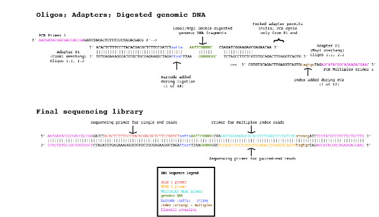

# Double Digest RADseq pipeline

## Overview

Restriction Associated DNA sequencing, or RADseq, is a method to construct reduced-representation libraries from
random fragments of a genome that has been digested with restriction enzymes ([Baird et al. 2008](http://journals.plos.org/plosone/article?id=10.1371/journal.pone.0003376)). The Double Digest
RADseq (ddRADseq) method relies on combined indexing that allows for enhanced multiplexing and sequencing of a large
number of individuals ([Peterson et al. 2012](http://journals.plos.org/plosone/article?id=10.1371/journal.pone.0037135)).
Once a ddRADseq library has been sequenced, the resulting fastQ files must be computationally parsed in an efficient manner.

The stages of the Double Digest RADseq bioinformatic pipeline can be carried out using our program **ddradseq**.
The source code is written in C and is freely available from the [GitHub website](https://github.com/lummeianalytics/ddradseq).
This single program can handle all three steps of the ddRADseq pipeline. The software has been engineered to leave
a small memory footprint, and thus, should be able to handle a large number of individuals. To accomplish this, the
**ddradseq** program runs in three different modes, corresponding to different stages in the ddRADseq pipeline. The three
stages/modes can be described as follows:

1. **parse**:  A this first stage in the pipeline reads a database file to determine how the input fastQ sequences should be
   parsed. This step depends critically on a properly formatted text database file. For details on how to construct the
   database file, please see the **The CSV database file** subsection below. The program then parses the input fastQ
   sequences into separate files (representing individual biological samples) in an output directory tree that corresponds
   to the hierarchical order FLOWCELL/POOL/BARCODE.

2. **pair**: this second step in the pipeline insures that all sequences output from the first **parse** stage contain mates
   that are properly aligned and ordered in the files.

3. **trimend**: this final stage in the pipeline reads mate-pairs output from the preceeding **pair** stage and checks
   the 3' end of the reverse sequences for the presence of the custom barcode adapter sequence. The adapter sequence may
   be present if the library was constructing using fragments that are shorter than the combined resulting reads.
   When **ddradseq** is run in **trimend** mode, it performs a sequence alignment on the mate-pairs to check whether the
   reverse sequence runs past the beginning of the trimmed forward sequence. If this overhang is present, the **ddradseq**
   program will trim the overhang.

When all three steps in the pipeline have been completed, the resulting fastQ files in the "final/" output subdirectory
are ready to be used in a read mapping or assembly pipeline.

A Makefile is provided to compile the program. The **ddradseq** program was specifically written to compile and run
on a reasonably up-to-date GNU/Linux system and has been tested primarily on Debian- or RedHat-based distributions.
It is recommended that the program should be compiled using a version of GCC with at least a basic implementation of
inline functions from the C99 standard (> version 4.3). See the **Compiling** section below for more information.

## The ddRADseq library

The following graphic illustrates the structure of the ddRADseq library.


## Running the program

Running the base **ddradseq** program with the "--help" option produces the following informational message:
```
% ./ddradseq --help
Usage: ddradseq [OPTION...] INPUT_DIRECTORY
Parses fastQ files by flow cell, barcode, and/or index.

  -a, --across               Pool sequences across flow cells [default: false]
  -c, --csv=FILE             CSV file with index and barcode
  -d, --dist=INT             Edit distance for barcode matching [default: 1]
  -e, --gape=INT             Penalty for extending open gap [default: 1]
  -g, --gapo=INT             Penalty for opening a gap [default: 5]
  -m, --mode=STR             Run mode of ddradseq program [default: all]
  -o, --out=DIR              Parent directory to write output
  -p, --pattern=STR          Input fastQ file glob pattern to match [default:
                             "*.fastq.gz"
  -s, --score=INT            Alignment score to consider mates properly paired
                             [default: 100]
  -?, --help                 Give this help list
      --usage                Give a short usage message
  -V, --version              Print program version

Mandatory or optional arguments to long options are also mandatory or optional
for any corresponding short options.

Valid run-time modes are 'parse', 'pair', and 'trimend'. See
https://github.com/lummeianalytics/ddradseq for documentation

Report bugs to <dgarriga@lummei.net>.
```
The program *requires* that both the "--out" and "--csv" options are specified by the user. The following table explains
each of the parameters in more detail:

Option          | Argument             | Description
----------------|----------------------|------------
`-m, --mode`    | Name of mode         | This option should be invoked if the user wishes to re-run the pipeline starting at a particular stage.
`-c, --csv`     | CSV text file        | The comma-separated database file, see **The CSV database file** section below for details on what information should be provided in this file.
`-o, --out`     | Filesystem directory | An existing directory on the filesystem where **ddradseq** should write all of its output.
`-d, --dist`    | Integer              | The maximum number of mismatches allowed for a barcode to be considered a match with a barcode sequence in the database file.
`-s, --score`   | Integer              | The number of matching bases for mate-pairs to be considered as overlapping.
`-g, --gapo`    | Integer              | The gap penalty invoked during the alignment in the **trimend** stage.
`-e, --gape`    | Integer              | The gap extension penalty invoked during the alignment in the **trimend** stage.
`-p, --pattern` | Glob expression      | A filename pattern to match all input fastQ files (e.g., "\*.fq.gz").
`-a, --across`  | None                 | Pool all sequences across all specified input flow cells.

The program will write all of its activity to the logfile "ddradseq.log". The log file will be written to the user's
current working directory. If the program fails, it is often useful to first check this log file for any error messages.

The non-optioned argument "INPUT_DIRECTORY" specifies the parent filesystem directory, below which all of the input
fastQ files can be found. The program searches all child directories in the directory tree. By default,
the **ddradseq** program will search for files ending in the suffix ".fastq.gz" as input for the program.
This behavior can be changed by invoking the "--pattern" option, which accepts a glob pattern, such as wildcards.
For example, if one wished to input only the following four fastQ files

1. smpl\_70.R1.fq.gz
2. smpl\_70.R2.fq.gz
3. smpl\_81.R1.fq.gz
4. smpl\_81.R2.fq.gz

one may use the option `--pattern "smpl_*.R?.fq.gz"` to filter through fastQ files in a directory tree.

It is wise to make sure that the output directory (specified by the "--out" option) and the "INPUT_DIRECTORY" are
different directories, to insure that **ddradseq** does not consider fastQ files generated by previous runs as input.

### Example
```
% ./ddradseq -c rad48.csv.gz -p "test.*.fq.gz" -s 130 -o ~/ddradseq/output ~/data/ddradseq
```
or, the same command using long option switches

```
% ./ddradseq --csv rad48.csv.gz --pattern "test.*.fq.gz" --score 130 --out ~/ddradseq/output ~/data/ddradseq
```

## The CSV database file

Below is an example of the comma-separated database text file ("rad48.csv.gz"):
```
% zcat rad48.csv.gz | head
C4R08ANXX,CGATGT,JNW1b,AAGGA,1755
C4R08ANXX,CGATGT,JNW1b,AATTA,1716
C4R08ANXX,CGATGT,JNW1b,ACACA,1816
C4R08ANXX,CGATGT,JNW1b,AGCTA,1751
C4R08ANXX,TGACCA,JNW2b,GGCCA,1605
C4R08ANXX,TGACCA,JNW2b,TCTGC,1718
C4R08ANXX,TGACCA,JNW2b,TGCAT,1790
C4R08ANXX,TGACCA,JNW2b,TGGAA,1812
C7G4NANXX,ACAGTG,TornadoA,AACCA,2110
C7G4NANXX,ACAGTG,TornadoA,AAGGA,898
C7G4NANXX,ACAGTG,TornadoA,AATTA,867
C7G4NANXX,GCCAAT,TornadoB,TACGT,44
C7G4NANXX,GCCAAT,TornadoB,TAGTA,51
C7G4NANXX,GCCAAT,TornadoB,TATAC,52
C7G4NANXX,GCCAAT,TornadoB,TCACG,55
```
The database file has five fields. The first field is the Illumina flow cell identifier (as it appears in the fastQ files).
The second field is the DNA sequence of the Illumina multiplex index. The thrid field is the custom identifier associated
with the multiplex index in the previous column (the pool ID). The fourth field is the DNA sequence of the custom barcode
that appears on the 5' end of the forward reads. The final field/column is the sample identifier that is associated with the
custom barcode sequence in the previous column (the sample ID).

## The output directory tree

If the **ddradseq** program is run in **parse** mode and the user specifies that they want output to the existing
file system directory "~/ddradseq/output/", the program will create the following output directory tree
```
output/
├── ddradseq-2016-09-28
    ├── C4R08ANXX
    │   ├── JNW1b
    │   │   ├── final
    │   │   ├── pairs
    │   │   └── parse
    │   └── JNW2b
    │       ├── final
    │       ├── pairs
    │       └── parse
    └── C7G4NANXX
        ├── TornadoA
        │   ├── final
        │   ├── pairs
        │   └── parse
        └── TornadoB
            ├── final
            ├── pairs
            └── parse
```
The first level of newly created output directories is named for the date (in YYYY-DD-MM format) on which the program
was run (e.g., "ddradseq-2016-09-28/" in the above example). The next level of directories are named using the Illumina
flow cell names (e.g.,"C4R08ANXX/" and "C7G4NANXX/"). The third level of output directories are named for the pool
identifier (e.g., "JNW1b/" and "JNW2b/" etc., above). Within each pool-level directory are three subdirectories that
will contain the output files from the three different stages of the pipeline. Finally, within each of these directories,
the user will find a pair of fastQ files for each individual sample. This means that the final individual sample paired
fastQ files will be found in the "final/" folders. These names of the resulting individual sample files will have the form
"smpl\_&lt;sample ID&gt;.R1.fq.gz" for forward sequences and "smpl\_&lt;sample ID&gt;.R2.fq.gz" for reverse sequences.

Note that if the "--across" switch is used, then there will be no higher-level flow cell directory and all the samples
will be pooled across input files from all specified flow cells.

## Python helper script
The script "ddradseq-bwa.py" is provided to assist in read assembly of the files output by the **ddradseq** program.
The script will invoke "bwa mem" to map the reads and will convert sam to bam using samtools.
```
% ./ddradseq-bwa.py --help
usage: use "python ./ddradseq-bwa.py --help" for more information

Control script for read assembly stage of the ddRadSeq pipeline

optional arguments:
  -h, --help           show this help message and exit
  -d DIR, --dir DIR    Directory containing input fastQ files
  -r FILE, --ref FILE  Name of file with reference sequence for read mapping
  -m N, --map N        Number of threads available for bwa read mapping
  -t N, --threads N    Number of threads available for concurrency
  -v, --version        show program's version number and exit

For more detailed information on how to run this script, see the overview document.
```
For example, to assemble all the processed reads in pool "JNW1b", with a reference sequence in file
"Pman_1.0_genomic.fa" using 4 threads, the following command can be used,
```
% ./ddradseq-bwa --dir ~/ddradseq/output/ddradseq-2016-09-28/C4R08ANXX/JNW1b --map 4 --ref ~/reference/Pman_1.0_genomic.fa
```

## Compiling

A simple Makefile is provided with the **ddradseq** program. The only dependency is the zlib runtime library and headers.
On Debian-based systems, the administrator can install these using the command
```
% sudo apt install zlib1g-dev
```
Alternatively, on RedHat-based systems, the following command will install the required zlib library,
```
% sudo yum install zlib-devel
```
The source code of the program can then be compiled by typing
```
% make
```
in the program directory. The resulting executable file `ddradseq` will be created in that same directory.
The user can then place the program anywhere in their executable search path. Executing the make command with the
"install" argument,
```
% make install
```
will install the executable program in the "bin/" directory in the user's home directory.

